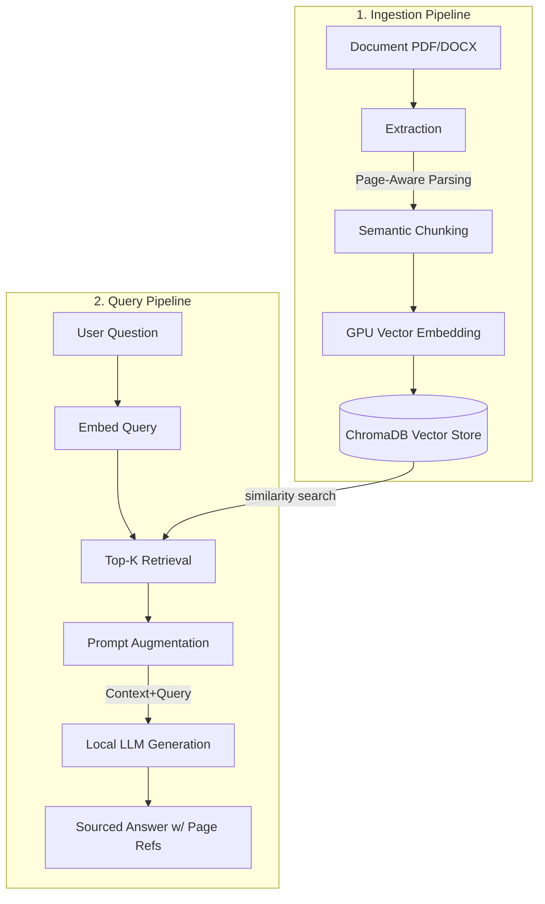

<div align="center">
  <h1>🔍 TraceRAG</h1>
  <p><strong>A Production-Ready, 100% Local RAG Pipeline with Exact Source Traceability</strong></p>

  [](https://opensource.org/licenses/MIT)
  [](https://fastapi.tiangolo.com/)
  [](https://www.docker.com/)
  [](https://ollama.com/)
  [](https://python.org/)

  <i>Turn any document (PDF, DOCX, TXT) into an interactive, zero-hallucination knowledge base.</i>
</div>

---

## 🌟 Overview

**TraceRAG** is an intelligent Question-Answering system designed for absolute accuracy. Unlike traditional RAG (Retrieval-Augmented Generation) setups, TraceRAG guarantees that every generated response actively cites its exact source location `[Page X]`. It runs entirely on your local machine, ensuring absolute data privacy without the need for expensive cloud APIs.

## ✨ Key Features

- **🎯 Exact Traceability** — Every claim cites its direct source document and page number `[Page X]`.
- **🚫 Zero Hallucinations** — Strict prompt engineering restricts the LLM exclusively to your provided documents.
- **🔒 100% Local & Private** — No data leaves your machine. Powered by [Ollama](https://ollama.com/) and local embedding models.
- **⚡ GPU Accelerated** — Optimized PyTorch + CUDA pipeline for blistering fast ingestion and inference.
- **🔌 Plug-and-Play Setup** — Completely fully automated download and setup scripts for both Windows & Docker.
- **📄 Multi-Format Support** — Seamlessly ingests PDF, DOCX, and TXT files.

---

## 🚀 Quick Start (Plug-and-Play)

We've made installation extremely frictionless. Whether you use Docker or Windows natively, downloading the repo and running one command will pull all dependencies, set up the environment, and download the LLM automatically.

### Option 1: Docker Compose (Recommended)
```bash
git clone https://github.com/guissii/TraceRAG.git
cd TraceRAG
docker-compose up --build
```
> **Note:** The setup will automatically pull the `phi3` model through Ollama in the background.

### Option 2: Windows Native (One-Click)
```bash
git clone https://github.com/guissii/TraceRAG.git
cd TraceRAG
```
👉 Simply double-click on `launch.bat`. 
*It will automatically detect Python, create an isolated virtual environment, install GPU dependencies, start Ollama, and pull the required models completely hands-free.*

**Once launched, the web dashboard will be available at:** [http://localhost:8000](http://localhost:8000)

---

## 🏗️ Architecture



---

## 📊 Performance Benchmarks

*Measured on a 58-page PDF (22,738 characters) utilizing an NVIDIA GPU (CUDA).*

| Pipeline Stage | Processing Time | Technical Details |
|-----------------|-----------------|-------------------|
| **Extraction** | 38 ms | Page-by-page parsing with preserved `[Page N]` metadata |
| **Chunking** | 5 ms | Semantic splitting (400 words / 60-word overlap) |
| **Embedding** | 337 ms | Rapid vectorization (384 dimensions) via CUDA |
| **Storage** | 54 ms | HNSW Indexing via ChromaDB |
| **Total Ingestion**| **~437 ms** | Complete document processed and deeply searchable |
| **Query & Inference**| 16–25 s | End-to-end local inference returning a sourced response |

---

## 🛠️ Tech Stack

- **Backend:** FastAPI + Uvicorn 
- **Embeddings:** SentenceTransformers (`all-MiniLM-L6-v2`)  
- **Vector Core:** ChromaDB (HNSW, Cosine Similarity)
- **Local LLM:** Phi-3 (3.8B params) via Ollama
- **Hardware Acceleration:** PyTorch + CUDA
- **Frontend Dashboard:** HTML5, CSS3, & Vanilla JS (Dynamic & Responsive UI)

---

## ⚙️ Configuration

Customizing TraceRAG is easy. Copy `.env.example` to `.env` and adjust the variables:

| Variable | Default Value | Description |
|----------|---------------|-------------|
| `OLLAMA_BASE_URL` | `http://localhost:11434` | Your Ollama Server URL |
| `OLLAMA_MODEL` | `phi3` | Choose your preferred LLM |
| `EMBEDDING_MODEL_NAME` | `all-MiniLM-L6-v2` | Dense retrieval model |
| `CHROMA_PATH` | `./chroma_data` | Persistent local DB storage point |
| `CHUNK_SIZE` | `400` | Text granularity for embeddings |

---

## 🌐 API Reference

Easily integrate TraceRAG into your own applications using our RESTful endpoints:

| Endpoints | Methods | Description |
|-----------|---------|-------------|
| `/` | `GET` | Main UI Dashboard |
| `/health` | `GET` | System heartbeat and component statuses |
| `/upload` | `POST` | Ingest and index new documents |
| `/documents` | `GET` | Retrieve list of all indexed files |
| `/documents/{name}` | `DELETE`| Remove a document from the Vector Store |
| `/chat` | `POST` | Core RAG Query Engine |

---

## 📂 Repository Structure

```text
TraceRAG/
├── main.py              # Main FastAPI orchestration
├── rag_engine.py        # Core RAG logic, chunking, & LLM communication
├── chroma_store.py      # Vector DB interaction layer
├── config.py            # Strongly-typed configuration system
├── requirements.txt     # Python environment requirements
├── frontend/            # Dedicated UI dashboard logic
├── docker-compose.yml   # Multi-service container orchestration
├── Dockerfile           # Optimized backend image
└── launch.bat           # Robust one-click installation & launcher
```

---

## 🤝 Contributing

Contributions are always welcome. Whether it is fixing bugs, adding new features, or improving documentation:
1. Fork the Project
2. Create your Feature Branch (`git checkout -b feature/AmazingFeature`)
3. Commit your Changes (`git commit -m 'Add some AmazingFeature'`)
4. Push to the Branch (`git push origin feature/AmazingFeature`)
5. Open a Pull Request

## 📝 License

Distributed under the MIT License. See `LICENSE` for more detailed information.

---
<div align="center">
  <b>Developed with ❤️ by <a href="https://github.com/guissii">guissii</a></b><br>
  <sub>If you find this project useful, please consider giving it a ⭐ on GitHub!</sub>
</div>
