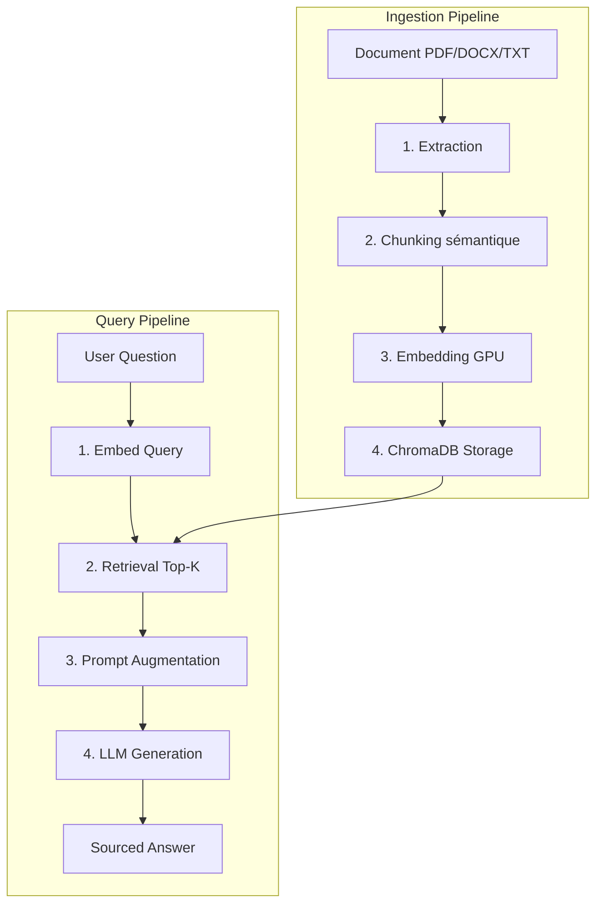

# TraceRAG

[](https://opensource.org/licenses/MIT)
[](https://fastapi.tiangolo.com/)
[](https://www.docker.com/)
[](https://ollama.com/)
[](https://python.org/)

> **Pipeline RAG complet avec traçabilité des sources.** Chaque réponse est liée à sa page d'origine — zéro hallucination, 100% local.

---

## Overview

**TraceRAG** est un système de Question-Answering intelligent qui transforme n'importe quel document (PDF, DOCX, TXT) en base de connaissances interrogeable. Chaque réponse inclut des citations précises avec le numéro de page exact.

### Key Features
- **Traçabilité complète** — Chaque affirmation cite sa source `[Page X]`
- **Anti-hallucination** — Le LLM répond uniquement à partir du contexte documentaire
- **100% local** — Aucune donnée ne quitte la machine, aucune API cloud payante
- **GPU accelerated** — Embedding et inférence optimisés sur NVIDIA CUDA
- **Multi-format** — Support PDF, DOCX et TXT

---

## Architecture



---

## Performance

Measured on a 58-page PDF (22,738 characters) with NVIDIA GPU + CUDA:

| Pipeline Step | Time | Details |
|--------------|------|---------|
| **Extraction** | 38 ms | Page-by-page parsing with `[Page N]` markers |
| **Chunking** | 5 ms | 13 chunks (400 words, 60-word overlap) |
| **Embedding** | 337 ms | 13 vectors × 384 dimensions (GPU CUDA) |
| **Storage** | 54 ms | ChromaDB HNSW cosine index |
| **Total Ingestion** | **437 ms** | Full document indexed |
| **Query Response** | 16–25 s | Retrieval + augmentation + LLM inference |

---

## Tech Stack

| Component | Technology | Role |
|-----------|-----------|------|
| **Backend** | FastAPI + Uvicorn | REST API orchestration |
| **Embeddings** | SentenceTransformers (`all-MiniLM-L6-v2`) | Semantic vectorization (384D) |
| **Vector Store** | ChromaDB | HNSW index, cosine similarity |
| **LLM** | Phi-3 via Ollama | Local inference (3.8B params) |
| **GPU** | PyTorch + CUDA | Accelerated embedding & inference |
| **Frontend** | HTML / CSS / JS | Real-time pipeline visualization |

---

## Getting Started

### Prerequisites
- Python 3.10+
- [Ollama](https://ollama.com/) installed and running
- (Optional) NVIDIA GPU with CUDA support

### Option 1: Docker (Recommended)

```bash
git clone https://github.com/guissii/TraceRAG.git
cd TraceRAG
docker compose up --build
```

The app will be available at `http://localhost:8000`.

### Option 2: Local Installation

1. **Clone & setup**:
   ```bash
   git clone https://github.com/guissii/TraceRAG.git
   cd TraceRAG
   python -m venv venv
   venv\Scripts\activate        # Windows
   # source venv/bin/activate   # Linux/Mac
   pip install -r requirements.txt
   ```

2. **GPU acceleration** (optional but recommended):
   ```bash
   # Install PyTorch with CUDA support
   pip install torch torchvision torchaudio --index-url https://download.pytorch.org/whl/cu121
   ```

3. **Start Ollama & pull the model**:
   ```bash
   ollama serve
   ollama pull phi3
   ```

4. **Run TraceRAG**:
   ```bash
   python main.py
   ```

5. **Open**: Navigate to `http://localhost:8000`

### Quick Start (Windows)

Double-click `launch.bat` — it handles everything automatically (Ollama, GPU detection, dependencies, server).

---

## Configuration

Copy `.env.example` to `.env` and adjust:

| Variable | Default | Description |
|----------|---------|-------------|
| `OLLAMA_BASE_URL` | `http://localhost:11434` | Ollama server URL |
| `OLLAMA_MODEL` | `phi3` | LLM model name |
| `EMBEDDING_MODEL_NAME` | `all-MiniLM-L6-v2` | Embedding model |
| `CHROMA_PATH` | `./chroma_data` | Vector DB storage path |
| `CHUNK_SIZE` | `400` | Words per chunk |
| `CHUNK_OVERLAP` | `60` | Overlap between chunks |

---

## API Endpoints

| Method | Endpoint | Description |
|--------|----------|-------------|
| `GET` | `/` | Frontend dashboard |
| `GET` | `/health` | System status & stats |
| `POST` | `/upload` | Index a document (PDF/DOCX/TXT) |
| `GET` | `/documents` | List indexed documents |
| `DELETE` | `/documents/{name}` | Remove a document |
| `POST` | `/chat` | Query the RAG pipeline |

---

## Project Structure

```
TraceRAG/
├── main.py              # FastAPI application & endpoints
├── rag_engine.py        # RAG pipeline (extraction, chunking, embedding, generation)
├── chroma_store.py      # ChromaDB wrapper
├── config.py            # Configuration (Pydantic Settings)
├── logging_config.py    # Logging setup
├── requirements.txt     # Python dependencies
├── frontend/
│   └── index.html       # Dashboard UI
├── Dockerfile           # Multi-stage Docker build
├── docker-compose.yml   # Full stack (API + Ollama)
├── launch.bat           # Windows one-click launcher
└── install_gpu.bat      # GPU setup script
```

---

## License

Distributed under the MIT License. See `LICENSE` for more information.

---

## Contributing

Contributions are welcome. Please open an issue or submit a pull request.

1. Fork the project
2. Create your feature branch (`git checkout -b feature/AmazingFeature`)
3. Commit your changes (`git commit -m 'Add AmazingFeature'`)
4. Push to the branch (`git push origin feature/AmazingFeature`)
5. Open a Pull Request

---

Developed by [guissii](https://github.com/guissii)
