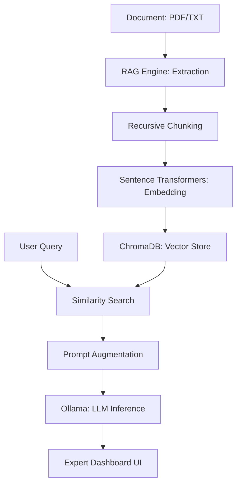

# 🧠 RAG Deep-Dive Inspector

[](https://opensource.org/licenses/MIT)
[](https://fastapi.tiangolo.com/)
[](https://www.docker.com/)
[](https://ollama.com/)

> **The ultimate educational dashboard for understanding Retrieval-Augmented Generation.** Stop the "black box" AI. Visualize every step of your RAG pipeline in real-time.

---

## 🌟 Overview

**RAG Deep-Dive Inspector** is a professional-grade, educational tool designed to demystify how RAG works. Instead of a simple chat interface, it provides a 4-stage analytical dashboard that traces data from ingestion to final inference.

### 🔬 Key Features
- **01. Ingestion Layer**: Track text extraction, smart chunking, and token counts.
- **02. Retrieval Engine**: Visualize vector embeddings, similarity scores, and metadata search.
- **03. Prompt Augmentation**: See exactly how context is injected into your system instructions.
- **04. LLM Inference**: Monitor performance metrics like TTFT and total token usage.
- **Hardware Optimized**: Specifically tuned for low-VRAM environments (4GB+) using local models.

---

## 🏗 Architecture



---

## 🚀 Getting Started

### Prerequisites
- Python 3.10+
- [Ollama](https://ollama.com/) installed and running
- (Optional) NVIDIA GPU with Docker support

### Option 1: Docker (Recommended)
The easiest way to get started with full environment isolation.

```bash
git clone https://github.com/guissii/rag-explorer.git
cd rag-explorer
docker-compose up --build
```

### Option 2: Local Installation
For quick development or systems without Docker.

1. **Clone & Setup**:
   ```bash
   git clone https://github.com/guissii/rag-explorer.git
   cd rag-explorer
   python -m venv venv
   source venv/bin/activate  # venv\Scripts\activate on Windows
   pip install -r requirements.txt
   ```

2. **Run the App**:
   ```bash
   python main.py
   ```

3. **Open the UI**: Navigate to `http://localhost:8000`

---

## ⚙️ Configuration

Copy `.env.example` to `.env` and adjust settings:
- `OLLAMA_BASE_URL`: URL of your local Ollama instance.
- `OLLAMA_MODEL`: Model name (default: `phi3`).
- `EMBEDDING_MODEL_NAME`: Vector model (default: `all-MiniLM-L6-v2`).

---

## 🛠 Tech Stack

- **Backend**: FastAPI, Pydantic v2, Uvicorn
- **Vector DB**: ChromaDB
- **Embeddings**: Sentence-Transformers (MiniLM-L6)
- **LLM**: Ollama (Phi-3, Mistral, etc.)
- **Frontend**: Modern Vanilla JS + CSS Grid (No heavy frameworks)
- **DevOps**: Multi-stage Docker build, Docker Compose

---

## 📄 License

Distributed under the MIT License. See `LICENSE` for more information.

---

## 🤝 Contributing

Contributions are welcome! Please open an issue or submit a pull request for any improvements.

1. Fork the Project
2. Create your Feature Branch (`git checkout -b feature/AmazingFeature`)
3. Commit your Changes (`git commit -m 'Add some AmazingFeature'`)
4. Push to the Branch (`git push origin feature/AmazingFeature`)
5. Open a Pull Request

---

Developed with ❤️ by [guissii](https://github.com/guissii)
